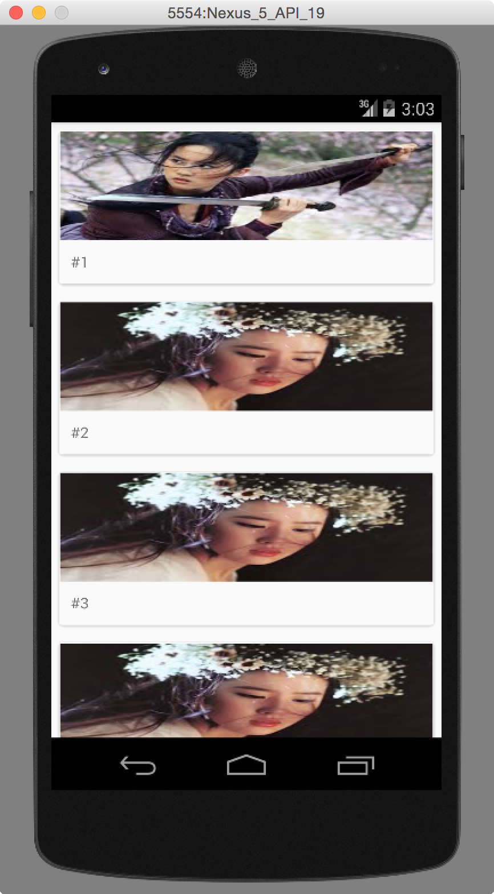

# RecyclerView + CardView



## 라이브러리 추가
recyclerview와 cardview를 사용하기 위해서는 별도의 라이브러를 추가 해주어야 한다. 자세한 내용은 [링크](https://medium.com/android-develop-android/android-%EA%B0%9C%EB%B0%9C-11-recyclerview%EC%99%80-cardview-fce1f4fc6c23)를 참조 하라.

## 레이아웃 구성

- activity_main.xml

> 기본 액티비티

```javascript
<RelativeLayout xmlns:android="http://schemas.android.com/apk/res/android"
    xmlns:tools="http://schemas.android.com/tools" android:layout_width="match_parent"
    android:layout_height="match_parent"
    tools:context=".MainActivity">

    <android.support.v7.widget.RecyclerView
        android:id="@+id/recyclerview"
        android:layout_width="match_parent"
        android:layout_height="match_parent"/>
</RelativeLayout>
```

- item_cardview.xml

> 리스트 내부에 추가될 아이템에 대한 액티비티

```javascript
<?xml version="1.0" encoding="utf-8"?>
<LinearLayout xmlns:android="http://schemas.android.com/apk/res/android"
    xmlns:card_view="http://schemas.android.com/apk/res-auto"
    android:orientation="vertical"
    android:layout_width="match_parent"
    android:layout_height="match_parent">
    <android.support.v7.widget.CardView
        android:id="@+id/cardview"
        card_view:cardCornerRadius="3dp"
        android:layout_width="match_parent"
        android:layout_height="wrap_content"
        android:layout_margin="5dp">

        <LinearLayout
            android:layout_width="match_parent"
            android:layout_height="wrap_content"
            android:orientation="vertical">
        <ImageView
            android:layout_width="match_parent"
            android:layout_height="100dp"
            android:id="@+id/image"/>
        <TextView
            android:id="@+id/title"
            android:layout_width="match_parent"
            android:layout_height="wrap_content"
            android:padding="10dp"
            android:text="ddd"/>
        </LinearLayout>
    </android.support.v7.widget.CardView>
</LinearLayout>
```

CardView의 테두리를 둥글게 하기 위해서 `card_view:cardCornerRadius="3dp"` 코드가 추가 되었다.

## Activity 구현

RecyclerView는 ListView와 같은 방식으로 어뎁터를 사용한다

### item 객체 정의

```java
public class RecyclerItem {
    int image;
    String title;

    int getImage(){
        return this.image;
    }
    String getTitle(){
        return this.title;
    }

    RecyclerItem(int image, String title){
        this.image=image;
        this.title=title;
    }
}
```

### 기본 액티비티 편집

```java
@Override
protected void onCreate(Bundle savedInstanceState) {
    ...
    RecyclerView recyclerView = (RecyclerView)findViewById(R.id.recycler_view);

    // 콘텐츠가 변화해도 RecyclerView의 레이아웃 크기가 변경되지 않을 경우
    // 성능 향상을 위해 이 설정을 사용
    recyclerView.setHasFixedSize(true);

    // linear layout manager를 사용
    LinearLayoutManager layoutManager = new LinearLayoutManager(this);
    recyclerView.setLayoutManager(layoutManager);

    List<RecyclerItem> items = new ArrayList<>();
    RecyclerItem[] item = new RecyclerItem[5];
    item[0] = new RecyclerItem(R.drawable.a, "#1");
    item[1] = new RecyclerItem(R.drawable.b, "#2");
    item[2] = new RecyclerItem(R.drawable.a, "#3");
    item[3] = new RecyclerItem(R.drawable.b, "#4");
    item[4] = new RecyclerItem(R.drawable.b, "#5");

    for(int i=0;i<item.length;i++) items.add(item[i]);

    recyclerView.setAdapter(new RecyclerAdapter(getApplicationContext(), items, R.layout.activity_main));
    ...
}
```

### 어뎁터 정의

```java
public class RecyclerAdapter extends RecyclerView.Adapter<RecyclerAdapter.ViewHolder> {
    Context context;
    List<RecyclerItem> items;
    int item_layout;
    public RecyclerAdapter(Context context, List<RecyclerItem> items, int item_layout) {
        this.context=context;
        this.items=items;
        this.item_layout=item_layout;
    }

    @Override
    public ViewHolder onCreateViewHolder(ViewGroup parent, int viewType) {
        View v= LayoutInflater.from(parent.getContext()).inflate(R.layout.item_cardview, parent, false);
        return new ViewHolder(v);
    }

    @TargetApi(Build.VERSION_CODES.JELLY_BEAN)
    @Override
    public void onBindViewHolder(ViewHolder holder, int position) {
        final RecyclerItem item=items.get(position);
        Drawable drawable=context.getResources().getDrawable(item.getImage());
        holder.image.setBackground(drawable);
        holder.title.setText(item.getTitle());
        holder.cardview.setOnClickListener(new View.OnClickListener() {
            @Override
            public void onClick(View v) {
                Toast.makeText(context, item.getTitle(), Toast.LENGTH_SHORT).show();
            }
        });
    }

    @Override
    public int getItemCount() {
        return this.items.size();
    }

    public class ViewHolder extends RecyclerView.ViewHolder {
        ImageView image;
        TextView title;
        CardView cardview;

        public ViewHolder(View itemView) {
            super(itemView);
            image=(ImageView)itemView.findViewById(R.id.image);
            title=(TextView)itemView.findViewById(R.id.title);
            cardview=(CardView)itemView.findViewById(R.id.cardview);
        }
    }
}
```

## References
- [Android Develop & Android](https://medium.com/android-develop-android/android-%EA%B0%9C%EB%B0%9C-11-recyclerview%EC%99%80-cardview-fce1f4fc6c23)
