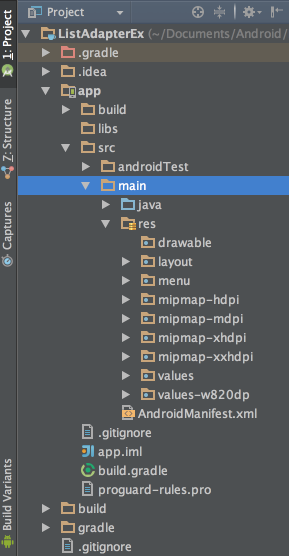

# AndroidStudio에 이미지 추가하기

eclipse를 이용할 때에는 drawable-hdpi , drawable-mdpi , drawable-xhdpi , drawable-xxhdpi 이름으로 된 디렉토리에 사이즈에 맞는 이미지를 넣어서 사용했지만 AndroidStudio에서는 디렉토리 구조가 변경되었다.

AndroidStudio의 좌측부분에 배치되어 있는 Project Window의 형식을 Android에서 Project로 바꾸면 프로젝트의 전체 폴더와 파일이 보이게 된다. (리소스 디렉토리`app/src/main/res`)를 펼치면 다음과 같은 형식(`minmap-{해상도}`)의 디렉토리들을 확인 할 수 있다.

해당 디렉토리들에 해상도에 맞게 이미지를 넣어서 사용하면 된다. 다음과 같은 방식으로 사용하면 된다 `R.mipmap.{이미지명}`
