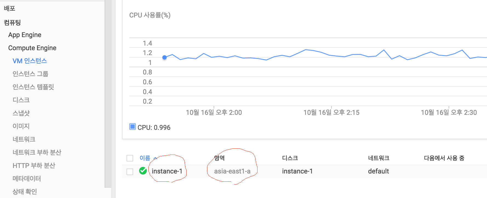

# Mac에서 Google Cloud SSH 활용하기

## Google Cloud SDK 설치

```
$ curl https://sdk.cloud.google.com | bash
```

`엔터`, `Y`를 입력하여 설치하면 `~/google-cloud-sdk` 디렉토리에 sdk가 설치 되고 환경변수에 등록된다.

## Google Cloud 계정 선택 및 권한 설정

아래 명령을 실행하면 브라우저를 통해서 나타나는 구글 계정 선택 화면에서 구글 클라우드를 사용하고 있는 계정을 선택하고 다음에 나타나는 권한 허용 페이지에서 허용을 선택한다.

```
$ gcloud auth login
```

## 작업 프로젝트 선택

아래 명령을 이용하여 작업 대상 프로젝트를 지정한다.

```
$ gcloud config set project {PROJECT}
```

## 접속

자신이 사용하고 있는 `인스턴스명`과 `지역명`을 포함하여 아래 명령을 수행하면 접속이 된다.

```
$ gcloud compute ssh {인스턴스명} --zone {지역명}
```


